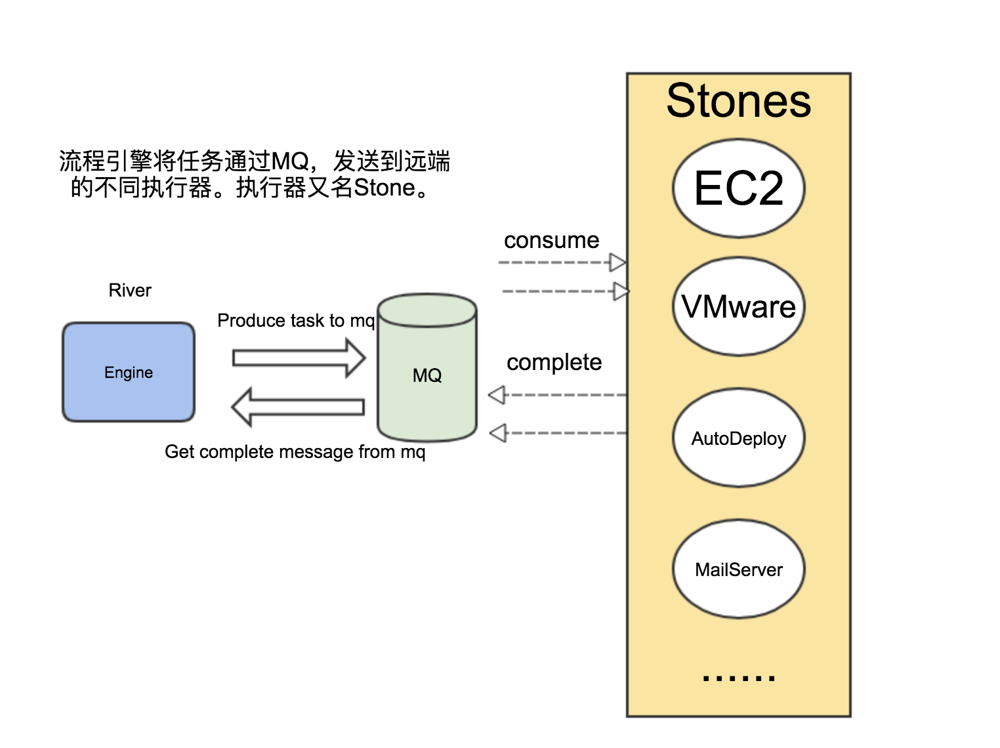

## 架构原理

### 组成与简介

`SipRS`是结合了开源工作流框架`activiti`和消息队列`amqp`协议的流程引擎。其本身也按照微服务开发的思维，具有非常清晰的业务粒度。

`SipRS`由两部分组成，一部分是驱动引擎，包括数据库，消息中间件，驱动引擎服务，和Web控制台；另一部分是远端遵循通信协议的执行器，及各类服务。

* 数据库采用的是Mysql
* 消息中间件目前采用的是RabbitMQ

我们将驱动引擎命名为River,将执行器命名为Stone。驱动引擎通过消息服务，驱动着执行器工作，一起构成了整个服务驱动体系；就像河流汇聚和连通着各种形状的鹅卵石。所以SipRs也被命名为River&Stones。

> 分别命名也是强调了`SipRS`引擎，对流程和业务的严格区分。

### 驱动原理

如图所示，`River`驱动`Stone`工作的步骤为：

1. River将任务发送到指定的消息队列中
2. Stone监听对应的消息队列，并执行业务逻辑
3. Stone完成逻辑后，将结果发送到指定消息队列
4. River监听消息队列，触发引擎的complete事件

